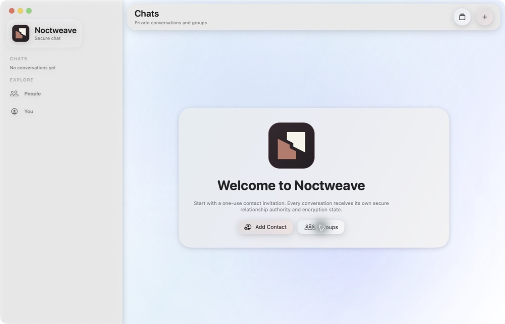
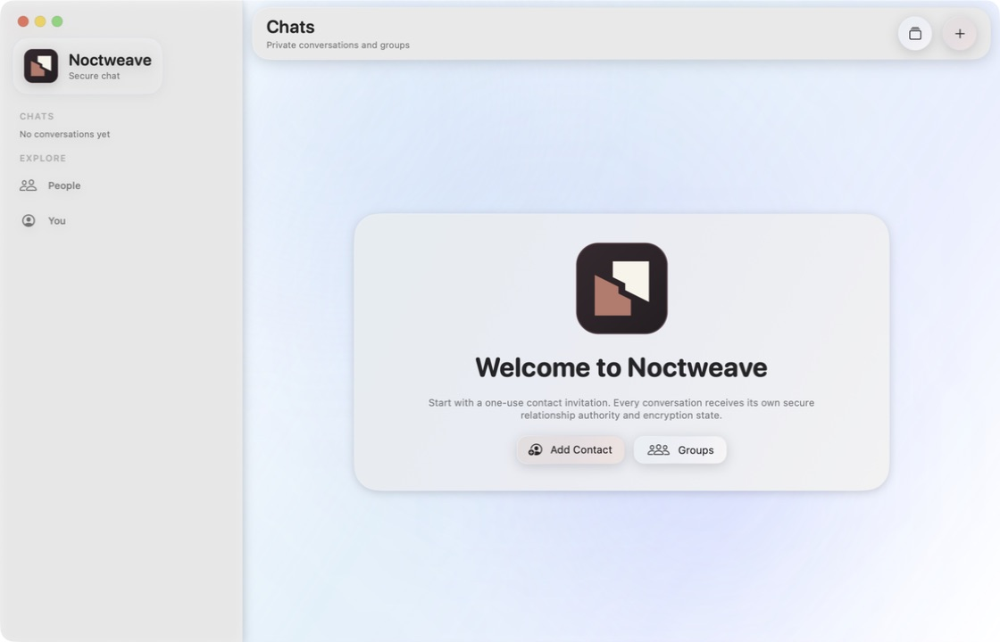
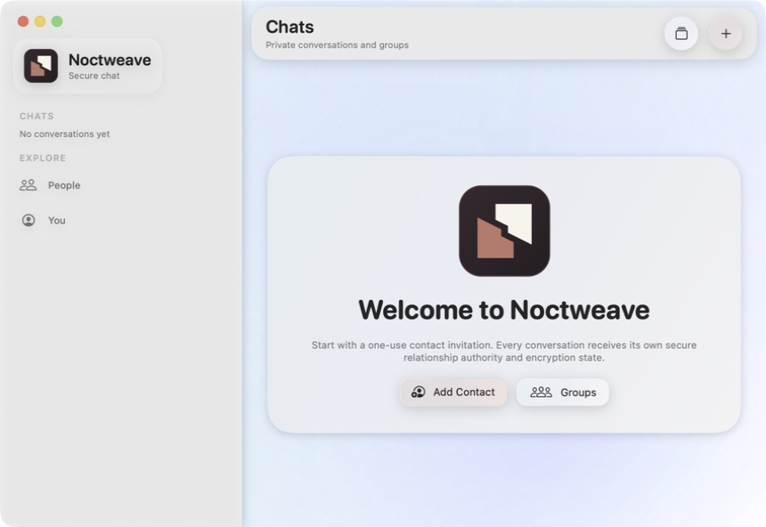
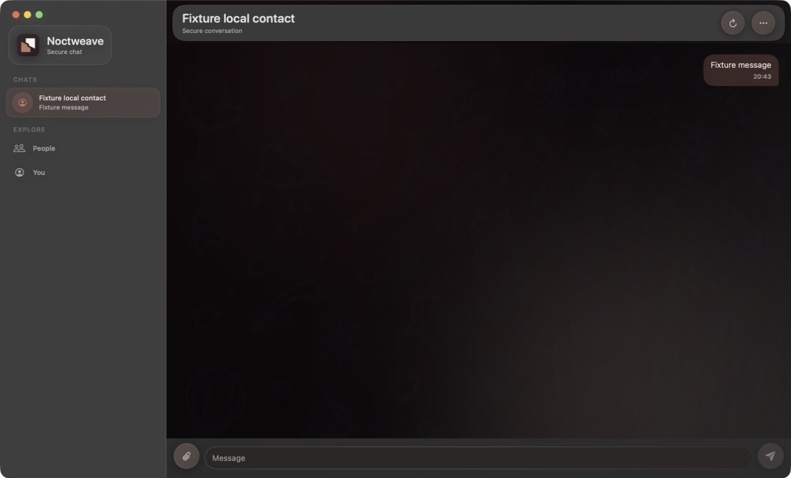
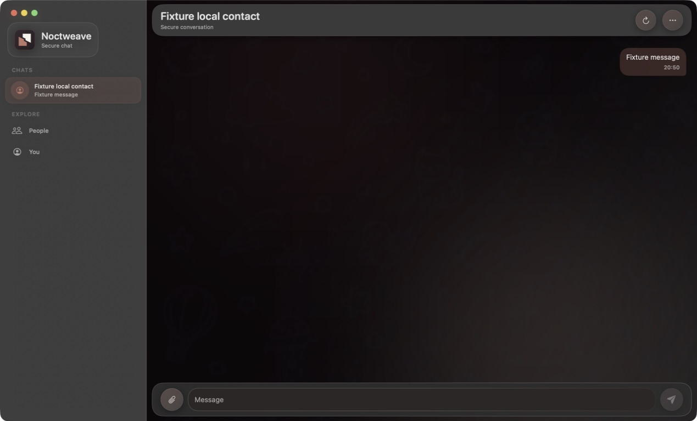
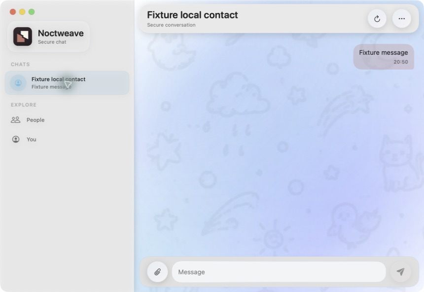
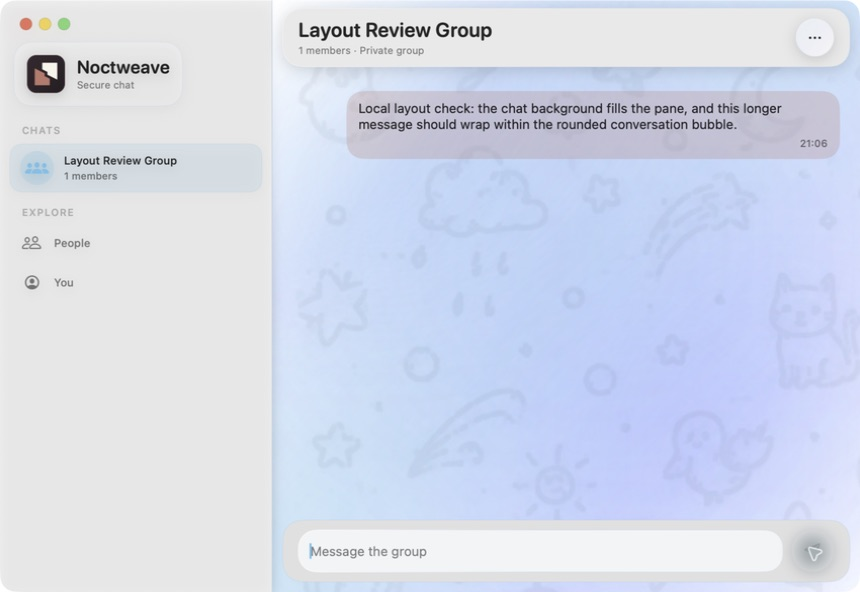

# macOS chat and welcome layout correction — 7 September 2026

The user identified two defects missed by the earlier UI pass: the native macOS chat background stopped above the composer, and the welcome card's content sat left of its rounded container. Both were reproduced in the running app and corrected in `Noctweave Messaging Client/MatureClientShell.swift` in the separate client repository.

## Corrected layout

| Surface | Observed defect | Change and rendered result |
| --- | --- | --- |
| Empty Chats welcome card | At 1120 × 720, the card was centered in the conversation pane, but its logo, title, description, and buttons were approximately 50 pixels left of the card center. | The welcome content explicitly fills and centers within the card before the shared card styling is applied. The 1120 × 720 and 860 × 592 captures show centered content, even side padding, and visible actions. |
| Direct and group chat background | The wallpaper belonged only to the message-list region. The composer created a separate rectangular band across the bottom of the pane. | On macOS the wallpaper now belongs to the whole conversation view, including the area behind the header and composer. Its decorative drawing is bounded to the available pane and excluded from accessibility. |
| Direct and group composer | The input was shorter than adjacent controls, and the full-width bottom panel did not match the inset header. | The input has a 42-point minimum outer height. The composer uses continuous 20-point corners and 10-point side insets that match the header. A two-line draft stays within the composer; controls remain aligned at its bottom. |

The shared card style retains its leading alignment for ordinary content. The centering adjustment is local to the welcome card. The macOS composer treatment is platform-gated; the existing iOS composer placement is retained.

## Before and after

Welcome, before:

Welcome, after, at the same size and palette:

Welcome, after, at minimum window size:

Direct chat, before and after, in the dark palette:

Direct chat, after, in the light palette at minimum size:

Group chat, after a message to a local one-member review group:

## Verification and limits

- The final macOS arm64 app build passed.
- Three existing macOS UI tests passed with zero failures: product navigation, header inset, and the loaded conversation/receipt presentation. These tests exercise navigation and existing behavior; the visual checks above establish the welcome and wallpaper corrections.
- The running native app was inspected using disposable empty-ready and product-fixture states. Direct conversations were checked in light and dark palettes, at compact, regular, and larger window sizes. Welcome centering was checked at 860 × 592 and 1120 × 720.
- A one-member group was created against an isolated loopback relay. A synthetic message was submitted through the app and rendered with wrapping inside its bubble. Empty and populated group views were inspected at compact size, and the populated view was also inspected at regular size. No other person was contacted.
- `git diff --check` passed in the client repository. No protocol, cryptographic, storage-protection, or permission behavior was changed.

This is a focused macOS correction, not a new certification of all app states. Physical devices, iOS layout after this shared welcome adjustment, arbitrary draft wrapping, and production signing were not retested in this follow-up. The earlier audit's remaining limits still apply.

[Validation metadata and screenshot hashes](ui_chat_layout_evidence_2026-09-07/validation.json) · [Build and test excerpts](ui_chat_layout_evidence_2026-09-07/validation-log-excerpts.txt)

Full logs and the Xcode result bundle remain in the ignored `.runtime/chat-layout-2026-09-07/` directory. The review app and test relay were stopped; task-specific DerivedData was removed. The isolated review app bundle is retained for reopening. Earlier source edits and the pre-existing Xcode user scheme-order change were preserved. The reviewed client source was committed as [74b6bdf](https://github.com/luizwidmer/NoctweaveMessagingClient/commit/74b6bdfd0f6100acf6b7fd696599450abd2bcc0d); validation metadata retains the uncommitted capture-time snapshot.
