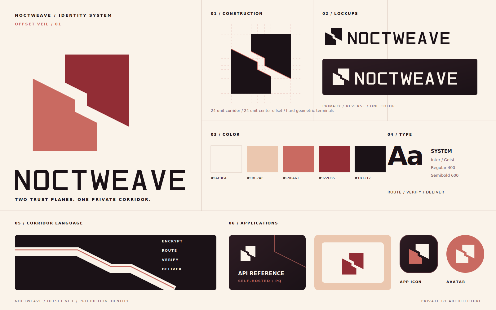

# Noctweave Visual Identity

Noctweave uses the **Offset Veil** identity system. Two independent geometric
planes define a stepped corridor through negative space. The planes represent
separate trust boundaries; the corridor represents ciphertext moving between
them without collapsing those boundaries into a shared identity.

## Canonical Assets

| Asset | Intended use |
| --- | --- |
| [`NoctweaveLogo.svg`](../docs/assets/NoctweaveLogo.svg) | Primary README and presentation lockup |
| [`NoctweaveWordmark.svg`](../docs/assets/NoctweaveWordmark.svg) | Wordmark without the symbol |
| [`NoctweaveMark.svg`](../docs/assets/NoctweaveMark.svg) | Primary two-color mark on light surfaces |
| [`NoctweaveMarkMonochrome.svg`](../docs/assets/NoctweaveMarkMonochrome.svg) | One-color mark on light surfaces |
| [`NoctweaveMarkReverse.svg`](../docs/assets/NoctweaveMarkReverse.svg) | One-color mark on dark surfaces |
| [`NoctweaveIcon.svg`](../docs/assets/NoctweaveIcon.svg) | General app icon and avatar |
| [`NoctweaveRelayIcon.svg`](../docs/assets/NoctweaveRelayIcon.svg) | Relay-specific app icon |

Do not redraw the mark from concept artwork. The SVG assets are the canonical
geometry.

## Construction

The mark uses a 256-unit square. Its primary measures are:

- 32-unit outer inset.
- 24-unit corridor at both terminals.
- 24-unit offset between the corridor's two center steps.
- Hard geometric terminals and corners.

Keep clear space equal to one quarter of the mark's width on every side. Use the
complete icon below 24 CSS pixels; do not place the two-color light-surface mark
directly on the plum-black interface background.

## Color System

| Token | Hex | Role |
| --- | --- | --- |
| Warm ivory | `#FAF3EA` | Primary light surface and reverse mark |
| Pale sand | `#EBC7AF` | Secondary surface and quiet highlight |
| Muted coral | `#C96A61` | Primary accent and lower plane |
| Deep wine | `#922D35` | Strong accent and upper plane |
| Plum black | `#1B1217` | Wordmark, dark surfaces, and one-color mark |

Product status colors are functional and sit outside the identity palette.
Success, warning, and destructive states must remain distinguishable from the
coral brand accent.

## Typography

Use Inter or Geist for interfaces and documentation. Use the outlined SVG
wordmark for brand lockups; do not typeset a replacement wordmark. Use a
monospaced system face for code, route identifiers, and protocol metadata.

## Graphic Language

The corridor can extend beyond the mark as a stepped route, crop, rule, or
content divider. Keep its angle and center offset consistent with the symbol.
It should describe boundaries or motion; it is not decorative striping.

## Voice and Lockups

The primary logo has no tagline. Product descriptors such as “Relay Console,”
“JavaScript Client,” or “API Reference” may appear as secondary interface text,
separated from the lockup. Noctweave should sound like durable infrastructure,
not a fantasy setting or secrecy product.

Repository positioning copy may remain near the logo, but it is not part of the
lockup and must not be embedded inside canonical logo assets.

## Avoid

- Do not add moons, stars, sparkles, shields, locks, or network-node ornaments.
- Do not reconnect the two planes or turn the corridor into a literal letter N.
- Do not rotate, outline, skew, glow, or add drop shadows to the mark.
- Do not reintroduce violet-blue-teal technology gradients.
- Do not place the primary two-color mark on a visually busy surface.
