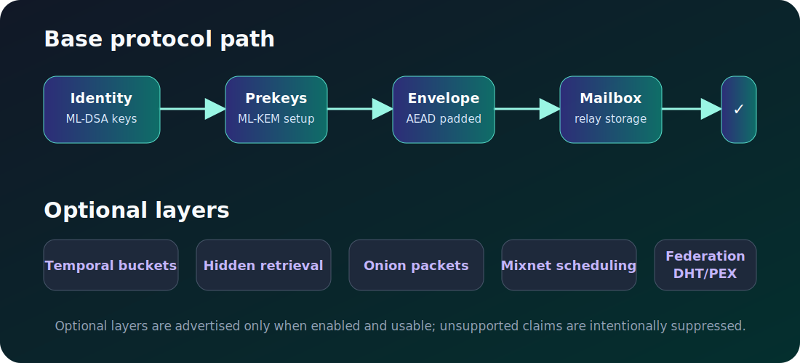

# Noctweave


Post-quantum encrypted messaging infrastructure.

Noctweave gives developers a Swift core, Linux relay, JavaScript relay client,
and CLI for building encrypted direct and group messaging without trusting the
relay with plaintext.

- Post-quantum identity and session setup: ML-DSA-65 + ML-KEM-768
- Relay-backed delivery for offline clients
- Direct messages, groups, attachments, and voice payloads
- Federation modes for solo relays, private meshes, curated networks, and open relay discovery
- Metadata-reduction primitives with clearly documented limits


## Try It Locally

Terminal 1: run an in-memory HTTP relay.

```sh
swift build --package-path "Noctweave Relay Server"
"Noctweave Relay Server/.build/debug/NoctweaveRelayServer" \
  --host 127.0.0.1 \
  --port 9341 \
  --http-port 9339 \
  --transport http \
  --memory-only
```

Terminal 2: run the browser messenger demo.

```sh
cd NoctweaveJS
npm install
npm run dev:browser-client
```

Open two profiles:

- [http://127.0.0.1:5173/examples/browser-client/?profile=alice](http://127.0.0.1:5173/examples/browser-client/?profile=alice)
- [http://127.0.0.1:5173/examples/browser-client/?profile=bob](http://127.0.0.1:5173/examples/browser-client/?profile=bob)

Create an inbox in both profiles, exchange contact codes, send a message, then
fetch it from the other profile. The demo creates in-browser ML-DSA/ML-KEM key
material through the Noctweave JS crypto adapter, signs relay requests, sends
encrypted envelopes, and verifies/decrypts received messages.

## What You Get



- `NoctweaveCore/` - Swift package for protocol models, post-quantum crypto bindings, relay client/server primitives, message ratchets, federation logic, and tests.
- `NoctweaveCore/Sources/NoctyraCLI/` - headless command-line client for relay diagnostics, API scripting, direct messaging, groups, attachments, voice payloads, identity rotation, and identity burn.
- `NoctweaveJS/` - JavaScript ESM package for browser/Node relay access, request helpers, WASM-backed liboqs integration, and memory, browser, IndexedDB, or database-backed storage.
- `Noctweave Relay Server/` - Linux relay implementation with TCP, HTTP, WebSocket, Docker, SQLite persistence, attachment TTLs, IPFS-compatible attachment offload, federation, DHT/PEX, and relay tests.
- `Noctweave Documentation/` - protocol specs, OpenAPI schema, security requirements, roadmap, release policy, and relay operator guidance.
- `agent-guides/` and `agent-skills/` - reusable AI-agent guidance for operating Noctweave messaging and relay flows.

## Who Should Care?

- Privacy app developers who want relay-backed encrypted messaging
- Swift developers building secure messaging clients
- Relay operators who want to run independent infrastructure
- Researchers reviewing post-quantum messaging and metadata-reduction designs
- AI-agent and automation developers who need headless secure messaging flows

## Security Status

Noctweave is pre-1.0 and unaudited.

Implemented:

- ML-KEM/ML-DSA protocol profile
- Relay ciphertext-only storage for message payloads
- Signed identity continuity events
- Replay rejection and actor-proof checks
- Bounded federation discovery and peer-exchange controls
- Test vectors, XCTest coverage, and bounded model-checking for selected group-state invariants

Not claimed:

- No global anonymity guarantee
- No hostile-OS protection
- No single-server cryptographic PIR guarantee
- No formal MLS proof
- No external cryptographic audit yet
- No guaranteed closed-app delivery without operating-system-permitted execution

See [`security_requirements.md`](Noctweave%20Documentation/security_requirements.md) and
[`noctweave_roadmap.md`](Noctweave%20Documentation/noctweave_roadmap.md) for the exact claim boundary.

## Naming

Noctweave is the open protocol and public infrastructure.

Noctyra is the reference tooling/client family built on top of Noctweave. The
public repo currently includes `NoctyraCLI` as the headless command-line tool,
so some command names and environment variables still use the `NOCTYRA_` prefix
for compatibility with the existing relay and CLI tooling.

## Build And Test

```sh
swift build --package-path NoctweaveCore
swift test --package-path NoctweaveCore
swift build --package-path "Noctweave Relay Server"
swift test --package-path "Noctweave Relay Server"
cd NoctweaveJS && npm test
```

Run the combined public Swift test suite:

```sh
scripts/run-tests.sh
```

Run the release verifier:

```sh
scripts/verify-release.sh
```

The release verifier checks SBOM freshness, package pins, dependency graph
health, and Linux relay tests. Docker and Trivy checks run only when those tools
are installed locally.

## Run The Linux Relay

```sh
swift build --package-path "Noctweave Relay Server"
"Noctweave Relay Server/.build/debug/NoctweaveRelayServer" \
  --host 0.0.0.0 \
  --port 9339 \
  --http-port 9340 \
  --data-dir /tmp/noctyra-relay
```

Docker:

```sh
docker build -t noctyra-relay "Noctweave Relay Server"
docker run --rm -p 9339:9339 -p 9340:9340 -v noctyra-data:/data noctyra-relay
```

See [`Noctweave Relay Server/README.md`](Noctweave%20Relay%20Server/README.md)
for relay flags, HTTP/WebSocket mode, TLS/reverse-proxy notes, federation
settings, storage modes, IPFS attachment offload, Docker, and Let's Encrypt
setup. See
[`federation_protocol_and_operations.md`](Noctweave%20Documentation/federation_protocol_and_operations.md)
for federation modes, protocol requests, coordinator setup, open-federation
DHT/PEX behavior, and operator recipes.

## Use NoctyraCLI

```sh
swift run --package-path NoctweaveCore NoctyraCLI help
swift run --package-path NoctweaveCore NoctyraCLI endpoint --relay https://relay.example
swift run --package-path NoctweaveCore NoctyraCLI health --relay http://127.0.0.1:9340
swift run --package-path NoctweaveCore NoctyraCLI info --relay http://127.0.0.1:9340
swift run --package-path NoctweaveCore NoctyraCLI init --display-name Alice --relay http://127.0.0.1:9340
swift run --package-path NoctweaveCore NoctyraCLI export-contact
```

The CLI accepts `host:port`, `http`, `https`, `ws`, `wss`, `tcp`, and `tls`
relay endpoints. It can initialize a headless identity, register an inbox,
exchange contact offers, send and fetch encrypted direct/group messages,
transfer attachments and voice payloads, inspect continuity audit events, rotate
or burn identities, and issue raw relay requests for diagnostics. See
[`noctyra_cli_usage.md`](Noctweave%20Documentation/noctyra_cli_usage.md).

## Use NoctweaveJS

```js
import {
  BrowserLocalStorageStore,
  NoctweaveRelayClient,
  NoctweaveStateRepository
} from "@noctweave/js-client";

const relay = new NoctweaveRelayClient("https://relay.example");
const store = new BrowserLocalStorageStore({ namespace: "my-app:noctweave" });
const state = new NoctweaveStateRepository(store);

await relay.health();
await state.save({ selectedRelay: "https://relay.example" });
```

`NoctweaveJS` supports HTTP/HTTPS and WebSocket/WSS relays plus memory, browser
`localStorage`, IndexedDB, and generic database adapters. The package includes a
WASM-backed liboqs adapter for the Noctweave ML-KEM/ML-DSA profile and keeps
WebCrypto for symmetric primitives where appropriate. See
[`NoctweaveJS/README.md`](NoctweaveJS/README.md).

## Documentation Map

- Relay API: [`noctweave_relay_openapi.yaml`](Noctweave%20Documentation/noctweave_relay_openapi.yaml)
- Protocol spec: [`noctweave_protocol_spec_v1.md`](Noctweave%20Documentation/noctweave_protocol_spec_v1.md)
- Whitepaper: [`noctweave_whitepaper.md`](Noctweave%20Documentation/noctweave_whitepaper.md)
- Core public API notes: [`noctweave_core_public_api.md`](Noctweave%20Documentation/noctweave_core_public_api.md)
- Core stability policy: [`noctweave_core_stability_policy.md`](Noctweave%20Documentation/noctweave_core_stability_policy.md)
- Wire format and test vectors: [`wire_format_and_test_vectors.md`](Noctweave%20Documentation/wire_format_and_test_vectors.md)
- Relay hardening guide: [`relay_ops_hardening_guide.md`](Noctweave%20Documentation/relay_ops_hardening_guide.md)
- Security requirements: [`security_requirements.md`](Noctweave%20Documentation/security_requirements.md)
- Roadmap: [`noctweave_roadmap.md`](Noctweave%20Documentation/noctweave_roadmap.md)
- Release/SBOM policy: [`dependency_sbom_and_release_policy.md`](Noctweave%20Documentation/dependency_sbom_and_release_policy.md)

## Good First Issues

- Record and add a short browser-demo GIF under `docs/assets/`.
- Add an operator quickstart for common reverse-proxy deployments.
- Add benchmark scripts for relay latency and core encrypt/decrypt costs.
- Add coverage reporting for `NoctweaveCore` and the Linux relay package.
- Add GitHub Actions for Linux relay tests and container scanning.
- Prepare signed release artifact instructions for relay binaries and Docker images.

## Release Artifacts

The repository is pre-1.0. Public npm, GHCR, and GitHub Release artifacts should
be added once the release gates in
[`noctweave_roadmap.md`](Noctweave%20Documentation/noctweave_roadmap.md) are
closed. Until then, the supported path is local source checkout plus the
verification commands above.

## License

Noctweave public source code is licensed under `AGPL-3.0-or-later`. Commercial
licenses are available for proprietary products, hosted commercial deployments,
private forks, and integrations that cannot comply with AGPL terms. See
[`COMMERCIAL-LICENSE.md`](COMMERCIAL-LICENSE.md).

Noctweave documentation and whitepaper materials are licensed under
`CC-BY-NC-SA-4.0` unless otherwise noted. See [`LICENSE-DOCS.md`](LICENSE-DOCS.md).
