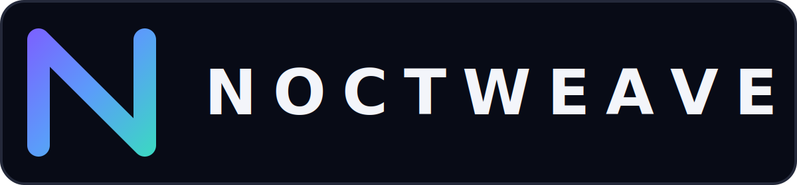
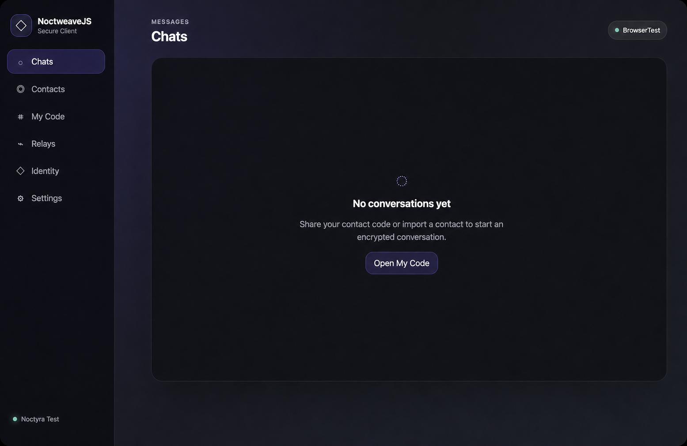
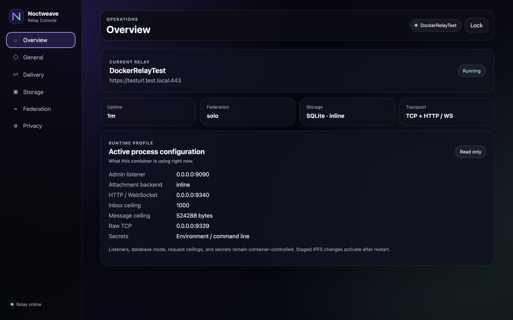
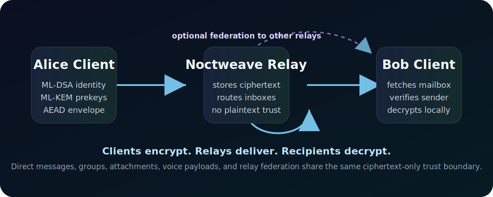
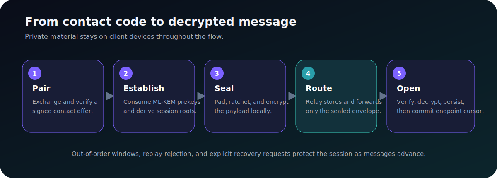

<p align="center">
  
</p>

<p align="center"><strong>Post-quantum messaging. Private by design. Future by default.</strong></p>

<p align="center">
  <a href="#install-and-try-it">Install</a> ·
  <a href="#use-the-tools">Use</a> ·
  <a href="#desktop-apps">Desktop apps</a> ·
  <a href="#security-status">Security</a> ·
  <a href="#documentation">Documentation</a>
</p>

<p align="center">
  
  
  
  
  
</p>

# Noctweave

Noctweave is a self-hosted toolkit for adding encrypted messaging to an
application. It includes a Swift protocol core, a Linux/Docker relay, a working
JavaScript client, and a headless CLI. Relays route and store encrypted
envelopes; message plaintext and private identity keys stay with clients.

There are no hosted accounts, developer-operated relays, or required central
notification services. You choose where every component runs.

## Architecture Revision Status

The pre-1.0 `architecture-revision` work now provides independently keyed local
endpoints scoped to a disposable identity generation, one certified preferred
direct endpoint, endpoint-scoped
ordered mailbox cursors, durable exact-ciphertext retries, typed encrypted
events and controls, privacy-minimized inbox registration, bounded replay-safe
receive receipts, and local read-only history export/import inside a padded
recipient-KEM transport seal. The in-process and Linux relays expose only the
1.0 mailbox, rendezvous, opaque-route, attachment, and federation surfaces;
fingerprint-addressed pairing, prekey storage, groups, and destructive inbox
acknowledgement are not protocol operations.

This is not yet a complete multi-endpoint protocol. Purpose-bound
same-generation endpoint admission exists only as an internal conformance
model; there is no public authorization, linking, or recovery flow. A safe
multi-endpoint release still requires a rendezvous transport, published
self-sync, multi-endpoint fan-out, encrypted route exchange, complete removal
obligations, and active endpoint-aware group delivery. The current group construction is
Noctweave-specific, experimental, O(n), and independently unaudited; the signed
endpoint-aware group objects are a tested foundation, not the active relay
or client group path. See the
[architecture status matrix](NoctweaveDocumentation/noctweave_architecture_revision_v2.md)
before selecting a protocol surface.

## Install And Try It

The quickest path uses Docker for the relay and a browser for two local clients.

### 1. Get the source

```sh
git clone https://github.com/luizwidmer/Noctweave.git
cd Noctweave
```

You need [Docker](https://www.docker.com/) and Node.js 20 or newer. Swift and
Bun are only required for the native packages and desktop launchers.

### 2. Start a relay

```sh
export NOCTWEAVE_ADMIN_TOKEN="$(openssl rand -hex 32)"

docker build -t noctweave-relay NoctweaveRelayServer
docker run --rm --name noctweave-relay \
  -p 9339:9339 \
  -p 9340:9340 \
  -p 127.0.0.1:9090:9090 \
  -e NOCTWEAVE_ADMIN_TOKEN \
  -v noctweave-relay-data:/data \
  noctweave-relay \
  --host 0.0.0.0 \
  --port 9339 \
  --http-port 9340 \
  --admin-port 9090 \
  --data-dir /data
```

The messaging endpoint is `http://127.0.0.1:9340`. Open the authenticated
operator console at [http://127.0.0.1:9090/admin/](http://127.0.0.1:9090/admin/)
and enter the generated token.

### 3. Open two clients

```sh
cd NoctweaveJS
npm install
npm run dev:client
```

Open two independent profiles:

- [Alice](http://127.0.0.1:5173/client/?profile=alice)
- [Bob](http://127.0.0.1:5173/client/?profile=bob)

Set the relay to `http://127.0.0.1:9340`, create both identities, exchange
contact codes, and send a message.

Current contact codes are reusable compatibility material, not one-time
unlinkable rendezvous offers. Sharing the same code lets recipients correlate
the same identity generation, preferred endpoint authorization, inbox, and
relay details.



## Use The Tools

| I want to… | Start here |
| --- | --- |
| Run a relay | [`NoctweaveRelayServer/`](NoctweaveRelayServer/) |
| Build a browser or Node client | [`NoctweaveJS/`](NoctweaveJS/) |
| Integrate from Swift | [`NoctweaveCore/`](NoctweaveCore/) |
| Script identities and messages | [`NoctweaveCLI`](NoctweaveDocumentation/noctweave_cli_usage.md) |
| Review the pre-1.0 architecture | [`Architecture revision v2`](NoctweaveDocumentation/noctweave_architecture_revision_v2.md) |
| Review read-only endpoint history transfer | [`History transfer v2`](NoctweaveDocumentation/history_transfer_v2.md) |
| Review the compatibility wire surface | [`Protocol v1 compatibility specification`](NoctweaveDocumentation/noctweave_protocol_spec_v1.md) |

### Relay

<p align="center">
  
</p>

The relay supports raw TCP, HTTP/HTTPS, WebSocket/WSS, SQLite persistence,
attachments, groups, federation, optional IPFS offload, and an authenticated
operator console. A solo relay works without federation.



For production deployment, reverse proxies, federation, secrets, and storage,
use the [relay guide](NoctweaveRelayServer/README.md) and
[operator hardening guide](NoctweaveDocumentation/relay_ops_hardening_guide.md).

### NoctweaveJS

Run the working browser client:

```sh
cd NoctweaveJS
npm install
npm run dev:client
```

Use the library from an application:

```js
import {
  BrowserLocalStorageStore,
  EncryptedNoctweaveStore,
  NoctweaveRelayClient
} from "@noctweave/js-client";

const relay = new NoctweaveRelayClient("https://relay.example");
const backend = new BrowserLocalStorageStore({ namespace: "my-app:noctweave" });
const store = new EncryptedNoctweaveStore(backend, {
  keyBytes: await loadApplicationKey() // exactly 32 bytes
});

await relay.health();
await store.set("selectedRelay", relay.endpoint);
```

See the [NoctweaveJS guide](NoctweaveJS/README.md) for browser storage,
database adapters, encrypted state, WASM setup, pairing, and interoperability.

### NoctweaveCLI

```sh
swift run --package-path NoctweaveCore NoctweaveCLI help
swift run --package-path NoctweaveCore NoctweaveCLI health \
  --relay http://127.0.0.1:9340
swift run --package-path NoctweaveCore NoctweaveCLI init \
  --display-name Alice \
  --relay http://127.0.0.1:9340
```

The CLI supports relay diagnostics, encrypted local identities, public
contact-share import and export, direct and group messaging, attachments,
continuity events, and
identity rotation. See the [CLI usage guide](NoctweaveDocumentation/noctweave_cli_usage.md).

## Desktop Apps

Noctweave includes source-built [Electrobun](https://electrobun.dev/) launchers.
Electrobun uses the operating system WebView instead of bundling Chromium.
Build on each operating system and architecture where the app will run.

Relay launcher:

```sh
cd NoctweaveRelayServer
bun install --frozen-lockfile
bun run desktop:icons
bun run desktop:dev
```

JavaScript client:

```sh
cd NoctweaveJS
bun install --frozen-lockfile
bun run desktop:dev
```

These launchers are convenience tools for local use and evaluation. No official
prebuilt desktop binaries are published yet.

## What Is Included



- **NoctweaveCore** — Swift protocol models, cryptographic flows, ratchets,
  relay primitives, federation logic, and tests.
- **NoctweaveRelayServer** — Linux/Docker relay, SQLite storage, operator Web
  UI, federation, and optional IPFS attachment storage.
- **NoctweaveJS** — browser/Node transports, encrypted stores, a working
  messaging client, and post-quantum WASM bindings.
- **NoctweaveCLI** — headless identity, relay, messaging, group, and attachment
  workflows.
- **AgentGuides and AgentSkills** — bounded guidance for integrating clients and
  operating relays through automation.



## Foundations And Dependencies

Noctweave builds on established open-source components rather than maintaining
custom cryptographic implementations or shipping a browser runtime:

- [Open Quantum Safe liboqs](https://github.com/open-quantum-safe/liboqs) supplies
  ML-KEM-768 and ML-DSA-65. The Docker build pins liboqs `0.16.0` to an immutable
  commit; Swift uses the vendored XCFramework; JavaScript uses a bounded WASM
  profile.
- [Electrobun](https://electrobun.dev/) packages the optional desktop client and
  relay launcher with native system WebViews.
- CryptoKit and WebCrypto provide symmetric cryptography where appropriate.
- SQLite provides persistent relay storage; IPFS is an optional encrypted-blob
  offload target, not an anonymity layer.

Exact versions, hashes, and supply-chain requirements are recorded in the
[dependency and SBOM policy](NoctweaveDocumentation/dependency_sbom_and_release_policy.md).

## Security Status

Noctweave is pre-1.0 and has not received an independent external audit.

| Implemented | Not claimed |
| --- | --- |
| ML-KEM/ML-DSA protocol profile | Protection from a compromised operating system |
| End-to-end encrypted payloads and attachments | Global anonymity |
| Signed identity continuity and replay rejection | Formal group-protocol proof or RFC 9420 interoperability |
| Bounded parsers, stores, and discovery inputs | Single-server cryptographic PIR |
| Relay ciphertext-only payload storage | Guaranteed closed-app delivery |

Review the [security requirements](NoctweaveDocumentation/security_requirements.md),
[internal audit](NoctweaveDocumentation/security_audit_2026-07-10.md), and
[roadmap](NoctweaveDocumentation/noctweave_roadmap.md) before production use.

## Build And Test

```sh
swift build --package-path NoctweaveCore
swift test --package-path NoctweaveCore
swift build --package-path NoctweaveRelayServer
swift test --package-path NoctweaveRelayServer
(cd NoctweaveJS && npm test)
```

Run the combined public checks with `scripts/run-tests.sh`. Run release, SBOM,
dependency, Docker, and optional container-scan checks with
`scripts/verify-release.sh`.

## Documentation

- [Identity philosophy and external-feature filter](NoctweaveDocumentation/noctweave_identity_philosophy.md)

Technical detail lives in focused documents:

- [Architecture revision v2 and implementation status](NoctweaveDocumentation/noctweave_architecture_revision_v2.md)
- [Extension proposal and promotion process](NoctweaveDocumentation/noctweave_extension_process.md)
- [Protocol v1 compatibility specification](NoctweaveDocumentation/noctweave_protocol_spec_v1.md)
- [Relay OpenAPI schema](NoctweaveDocumentation/noctweave_relay_openapi.yaml)
- [Wire format and test vectors](NoctweaveDocumentation/wire_format_and_test_vectors.md)
- [Core public API](NoctweaveDocumentation/noctweave_core_public_api.md)
- [Read-only history transfer v2](NoctweaveDocumentation/history_transfer_v2.md)
- [Experimental PQ group design](NoctweaveDocumentation/group_mls_design.md)
- [Federation protocol and operations](NoctweaveDocumentation/federation_protocol_and_operations.md)
- [Relay hardening](NoctweaveDocumentation/relay_ops_hardening_guide.md)
- [Whitepaper](NoctweaveDocumentation/noctweave_whitepaper.md)
- [Visual identity](NoctweaveDocumentation/visual_identity.md)

## Contributing

Contributions to the public protocol, relay, CLI, JavaScript implementation,
tests, documentation, and examples are welcome. Read
[`CONTRIBUTING.md`](CONTRIBUTING.md) for scope, testing, and path-specific
license requirements.

## License

Noctweave is a multi-license repository. The nearest license file governs:

| Path | License |
| --- | --- |
| `NoctweaveCore/`, `NoctweaveCLI`, `NoctweaveRelayServer/` | `AGPL-3.0-or-later` |
| `NoctweaveCore/COMMERCIAL-LICENSE.md` | Optional commercial terms for NoctweaveCore |
| `NoctweaveJS/` | `Apache-2.0` |
| `NoctweaveJS/examples/` | `MIT` |
| `NoctweaveDocumentation/`, `docs/assets/` | `CC-BY-SA-4.0` |

See [`NOTICE`](NOTICE), [`LICENSE`](LICENSE), and
[`COMMERCIAL-LICENSE.md`](COMMERCIAL-LICENSE.md) for the repository-level
summary.
