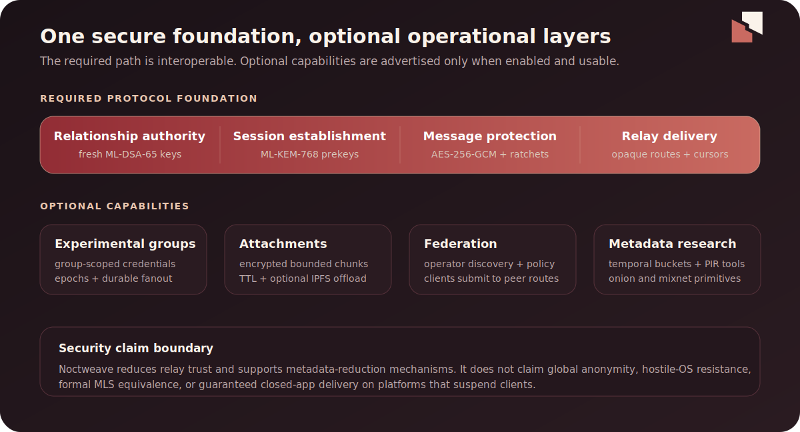

<p align="center">
  
</p>

<p align="center"><strong>Post-quantum messaging. Private by design. Future by default.</strong></p>

# Noctweave


Post-quantum messaging infrastructure for applications that should not trust a
relay with plaintext.

Noctweave provides a Swift protocol core, a Linux/Docker relay, a JavaScript
client library, and a headless CLI. You bring the application and choose the
relay infrastructure; Noctweave handles identities, encrypted envelopes,
mailbox delivery, and federation primitives.

- Post-quantum identity and session setup: ML-DSA-65 + ML-KEM-768
- Relay-backed delivery for offline clients
- Direct messages, groups, attachments, and voice payloads
- Federation modes for solo relays, private meshes, curated networks, and open relay discovery
- Metadata-reduction primitives with clearly documented limits

[Quick start](#try-it-locally) · [Components](#repository-components) ·
[Security status](#security-status) · [Documentation](#documentation-map) ·
[Licensing](#license)


## Why Noctweave?

Most encrypted-messaging projects need more than cryptographic primitives. They
also need offline delivery, key continuity, bounded parsing, recovery from
out-of-order messages, relay operations, and a clear trust model. Noctweave
packages those concerns into interoperable components while keeping plaintext
and private identity keys on client devices.

| Concern | Noctweave approach |
| --- | --- |
| Long-lived identity | ML-DSA-65 signatures and signed continuity events |
| Session setup | ML-KEM-768 prekeys and periodic post-quantum root ratchets |
| Message protection | Padded AES-256-GCM envelopes with symmetric ratcheting |
| Offline delivery | Authenticated relay mailboxes that store ciphertext |
| Independent operation | Self-hosted relays and explicit federation modes |
| Resource safety | Bounded wire inputs, storage, discovery, and client policy |

## Try It Locally

Run an in-memory HTTP relay:

```sh
swift build --package-path NoctweaveRelayServer
NoctweaveRelayServer/.build/debug/NoctweaveRelayServer \
  --host 127.0.0.1 \
  --port 9341 \
  --http-port 9339 \
  --transport http \
  --memory-only
```

In another terminal, run the NoctweaveJS client:

```sh
cd NoctweaveJS
npm install
npm run dev:client
```

Open two profiles:

- [http://127.0.0.1:5173/client/?profile=alice](http://127.0.0.1:5173/client/?profile=alice)
- [http://127.0.0.1:5173/client/?profile=bob](http://127.0.0.1:5173/client/?profile=bob)

Complete setup in both profiles, exchange contact codes, and send a message.
The client maintains a verified contact book, durable encrypted history,
unread state, retryable sends, and automatic inbox sync while visible. All
identity and session keys are generated in the browser. The relay receives
signed requests and sealed envelopes—not chat plaintext.


## JavaScript Client


NoctweaveJS includes two browser surfaces and an Electrobun desktop package:

- `client/` is the working minimal messaging application with encrypted profile
  setup, relay management, post-quantum identity creation, verified contacts,
  durable direct chats, unread state, sync, and encrypted backup/restore.
- `examples/browser-client/` is the interoperability demo used to exercise
  pairing and encrypted message exchange between two browser profiles.
- `desktop/` packages the working client with the system WebView for macOS,
  Windows, and Linux without bundling Chromium.

Run the production-oriented client with:

```sh
cd NoctweaveJS
npm run dev:client
```

Then open [http://127.0.0.1:5173/client/](http://127.0.0.1:5173/client/).
NoctweaveJS supports application-managed memory, localStorage, IndexedDB, and
database adapters; sensitive records should use the encrypted store wrapper.

Run the native desktop package on the current operating system with:

```sh
cd NoctweaveJS
bun install
bun run desktop:dev
```

For a non-interactive bidirectional chat check against a running relay:

```sh
cd NoctweaveJS
npm run smoke:client -- --relay http://127.0.0.1:9340
```

## Repository Components



- [`NoctweaveCore/`](NoctweaveCore/) — Swift protocol models, post-quantum
  bindings, ratchets, relay primitives, federation logic, and tests.
- [`NoctweaveCore/Sources/NoctyraCLI/`](NoctweaveCore/Sources/NoctyraCLI/) —
  headless identity, messaging, group, attachment, and relay workflows.
- [`NoctweaveJS/`](NoctweaveJS/) — browser/Node relay client, encrypted storage
  wrappers, WebCrypto helpers, and WASM-backed liboqs integration.
- [`NoctweaveRelayServer/`](NoctweaveRelayServer/) — Linux relay with TCP,
  HTTP/WebSocket, Docker, SQLite, an authenticated operator Web UI, federation,
  and optional IPFS offload.
- [`NoctweaveDocumentation/`](NoctweaveDocumentation/) — protocol, API,
  security, federation, deployment, and release documentation.
- [`AgentGuides/`](AgentGuides/) and [`AgentSkills/`](AgentSkills/) — reference
  guidance for agents that integrate or operate Noctweave.

## Intended Users

- Application developers adding relay-backed encrypted messaging
- Swift and JavaScript teams integrating the protocol into clients
- Operators running independent or federated relay infrastructure
- Researchers evaluating post-quantum messaging and metadata reduction
- Automation developers using the headless CLI and agent integrations

## Security Status

Noctweave is pre-1.0 and has not received an independent external audit. A
repository-wide internal security review was completed on July 10, 2026; see
[`security_audit_2026-07-10.md`](NoctweaveDocumentation/security_audit_2026-07-10.md).

Implemented:

- ML-KEM/ML-DSA protocol profile
- Relay ciphertext-only storage for message payloads
- Signed identity continuity events
- Replay rejection and actor-proof checks
- Bounded federation discovery and peer-exchange controls
- Bounded parsers, cryptographic inputs, state stores, retrieval plans, and relay configuration
- Test vectors, XCTest coverage, and bounded model-checking for selected group-state invariants

Not claimed:

- No global anonymity guarantee
- No hostile-OS protection
- No single-server cryptographic PIR guarantee
- No formal MLS proof
- No external cryptographic audit yet
- No guaranteed closed-app delivery without operating-system-permitted execution

See [`security_requirements.md`](NoctweaveDocumentation/security_requirements.md) and
[`noctweave_roadmap.md`](NoctweaveDocumentation/noctweave_roadmap.md) for the exact claim boundary.

## Naming

Noctweave is the open protocol and public infrastructure.

Noctyra is the reference tooling/client family built on top of Noctweave. The
public repo currently includes `NoctyraCLI` as the headless command-line tool,
so some command names and environment variables still use the `NOCTYRA_` prefix
for compatibility with the existing relay and CLI tooling.

## Build And Test

```sh
swift build --package-path NoctweaveCore
swift test --package-path NoctweaveCore
swift build --package-path NoctweaveRelayServer
swift test --package-path NoctweaveRelayServer
cd NoctweaveJS && npm test
```

Run the combined public Swift test suite:

```sh
scripts/run-tests.sh
```

Run the release verifier:

```sh
scripts/verify-release.sh
```

The release verifier checks SBOM freshness, package pins, dependency graph
health, and Linux relay tests. Docker and Trivy checks run only when those tools
are installed locally.

## Run The Linux Relay


The authenticated operator console provides a focused view of relay health,
storage, delivery policy, federation, and privacy capabilities. Non-secret
policy changes apply to future requests without dropping in-flight work; IPFS
backend changes are staged explicitly for the next container restart.

```sh
swift build --package-path NoctweaveRelayServer
NoctweaveRelayServer/.build/debug/NoctweaveRelayServer \
  --host 0.0.0.0 \
  --port 9339 \
  --http-port 9340 \
  --data-dir /tmp/noctyra-relay
```

Docker:

```sh
docker build -t noctyra-relay NoctweaveRelayServer
docker run --rm -p 9339:9339 -p 9340:9340 -v noctyra-data:/data noctyra-relay
```

See [`NoctweaveRelayServer/README.md`](NoctweaveRelayServer/README.md)
for relay flags, HTTP/WebSocket mode, TLS/reverse-proxy notes, federation
settings, storage modes, IPFS attachment offload, Docker, and Let's Encrypt
setup. See
[`federation_protocol_and_operations.md`](NoctweaveDocumentation/federation_protocol_and_operations.md)
for federation modes, protocol requests, coordinator setup, open-federation
DHT/PEX behavior, and operator recipes.

## Use NoctyraCLI

```sh
swift run --package-path NoctweaveCore NoctyraCLI help
swift run --package-path NoctweaveCore NoctyraCLI endpoint --relay https://relay.example
swift run --package-path NoctweaveCore NoctyraCLI health --relay http://127.0.0.1:9340
swift run --package-path NoctweaveCore NoctyraCLI info --relay http://127.0.0.1:9340
swift run --package-path NoctweaveCore NoctyraCLI init --display-name Alice --relay http://127.0.0.1:9340
swift run --package-path NoctweaveCore NoctyraCLI export-contact
```

The CLI accepts `host:port`, `http`, `https`, `ws`, `wss`, `tcp`, and `tls`
relay endpoints. It can initialize a headless identity, register an inbox,
exchange contact offers, send and fetch encrypted direct/group messages,
transfer attachments and voice payloads, inspect continuity audit events, rotate
or burn identities, and issue raw relay requests for diagnostics. See
[`noctyra_cli_usage.md`](NoctweaveDocumentation/noctyra_cli_usage.md).

## Use NoctweaveJS

```js
import {
  BrowserLocalStorageStore,
  EncryptedNoctweaveStore,
  NoctweaveRelayClient,
  NoctweaveStateRepository
} from "@noctweave/js-client";

const relay = new NoctweaveRelayClient("https://relay.example");
const backend = new BrowserLocalStorageStore({ namespace: "my-app:noctweave" });
const applicationManagedKeyBytes = await loadApplicationKey(); // exactly 32 bytes
const store = new EncryptedNoctweaveStore(backend, {
  keyBytes: applicationManagedKeyBytes
});
const state = new NoctweaveStateRepository(store);

await relay.health();
await state.save({ selectedRelay: "https://relay.example" });
```

`NoctweaveJS` supports HTTP/HTTPS and WebSocket/WSS relays plus memory, browser
`localStorage`, IndexedDB, and generic database adapters. The package includes a
WASM-backed liboqs adapter for the Noctweave ML-KEM/ML-DSA profile and keeps
WebCrypto for symmetric primitives where appropriate. See
[`NoctweaveJS/README.md`](NoctweaveJS/README.md).

## Documentation Map

- Relay API: [`noctweave_relay_openapi.yaml`](NoctweaveDocumentation/noctweave_relay_openapi.yaml)
- Protocol spec: [`noctweave_protocol_spec_v1.md`](NoctweaveDocumentation/noctweave_protocol_spec_v1.md)
- Whitepaper: [`noctweave_whitepaper.md`](NoctweaveDocumentation/noctweave_whitepaper.md)
- Core public API notes: [`noctweave_core_public_api.md`](NoctweaveDocumentation/noctweave_core_public_api.md)
- Core stability policy: [`noctweave_core_stability_policy.md`](NoctweaveDocumentation/noctweave_core_stability_policy.md)
- Wire format and test vectors: [`wire_format_and_test_vectors.md`](NoctweaveDocumentation/wire_format_and_test_vectors.md)
- Relay hardening guide: [`relay_ops_hardening_guide.md`](NoctweaveDocumentation/relay_ops_hardening_guide.md)
- Security requirements: [`security_requirements.md`](NoctweaveDocumentation/security_requirements.md)
- Internal security audit: [`security_audit_2026-07-10.md`](NoctweaveDocumentation/security_audit_2026-07-10.md)
- Roadmap: [`noctweave_roadmap.md`](NoctweaveDocumentation/noctweave_roadmap.md)
- Release/SBOM policy: [`dependency_sbom_and_release_policy.md`](NoctweaveDocumentation/dependency_sbom_and_release_policy.md)
- Visual identity: [`visual_identity.md`](NoctweaveDocumentation/visual_identity.md)

## Good First Issues

- Record and add a short browser-demo GIF under `docs/assets/`.
- Add an operator quickstart for common reverse-proxy deployments.
- Add benchmark scripts for relay latency and core encrypt/decrypt costs.
- Add coverage reporting for `NoctweaveCore` and the Linux relay package.
- Prepare signed release artifact instructions for relay binaries and Docker images.

## Release Artifacts

The repository is pre-1.0. Public npm, GHCR, and GitHub Release artifacts should
be added once the release gates in
[`noctweave_roadmap.md`](NoctweaveDocumentation/noctweave_roadmap.md) are
closed. Until then, the supported path is local source checkout plus the
verification commands above.

## License

Noctweave is a multi-license repository. Use the nearest license file or an
explicit SPDX/header to determine the license for a file.

| Path | License |
| --- | --- |
| `NoctweaveCore/` | `AGPL-3.0-or-later` |
| `NoctweaveCore/COMMERCIAL-LICENSE.md` | Optional commercial terms for NoctweaveCore only |
| `NoctweaveCore/Sources/NoctyraCLI/` | `AGPL-3.0-or-later` |
| `NoctweaveRelayServer/` | `AGPL-3.0-or-later` |
| `NoctweaveJS/` | `Apache-2.0` |
| `NoctweaveJS/examples/` | `MIT` |
| `NoctweaveDocumentation/`, `docs/assets/` | `CC-BY-SA-4.0`; see `NoctweaveDocumentation/LICENSE` |
| Unlisted repository files | `AGPL-3.0-or-later` unless otherwise noted |

See [`NOTICE`](NOTICE), [`LICENSE`](LICENSE), and
[`COMMERCIAL-LICENSE.md`](COMMERCIAL-LICENSE.md) for the repository-level
summary.
