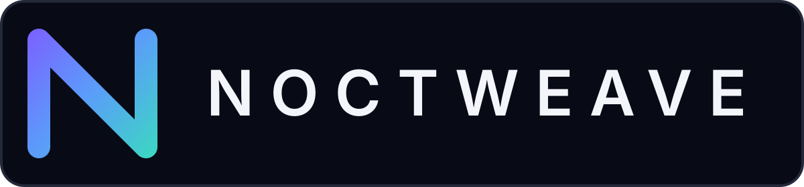
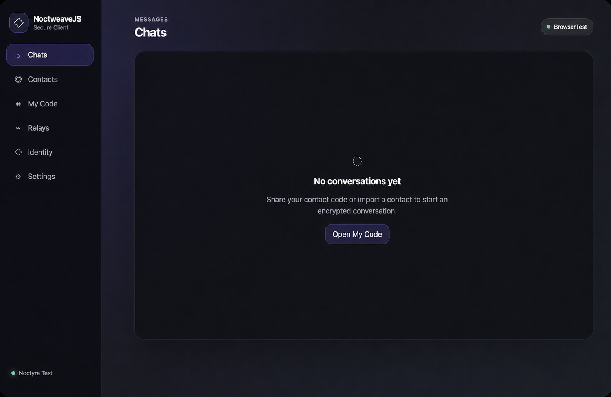
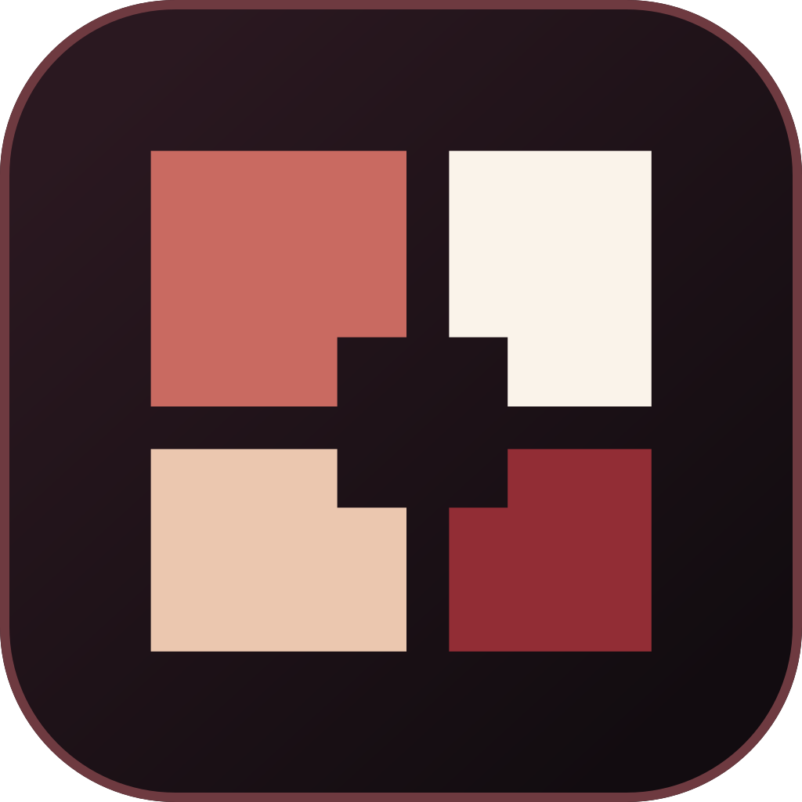
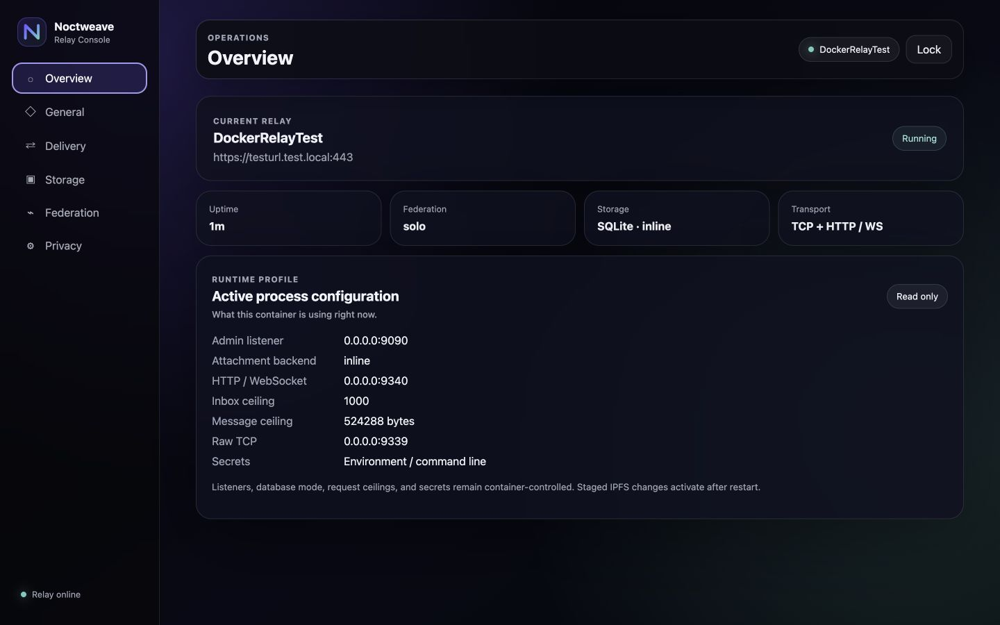
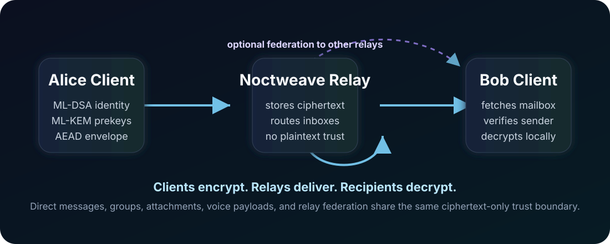
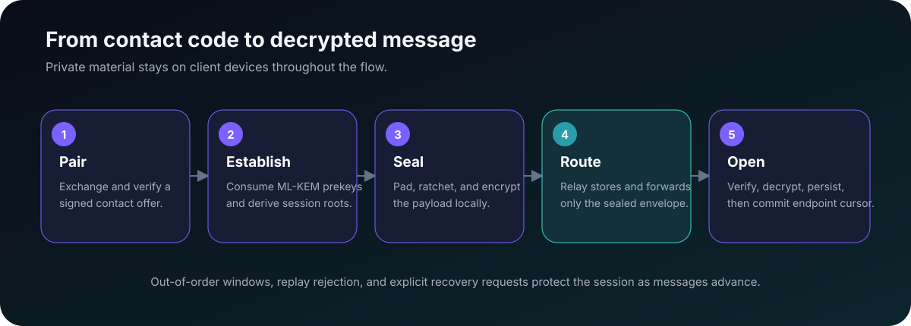

<p align="center">
  
</p>

<p align="center"><strong>Post-quantum messaging. Private by design. Future by default.</strong></p>

<p align="center">
  <a href="#install-and-try-it">Install</a> ·
  <a href="#use-the-tools">Use</a> ·
  <a href="#optional-electrobun-launchers">Desktop apps</a> ·
  <a href="#security-status">Security</a> ·
  <a href="#documentation">Documentation</a>
</p>

<p align="center">
  
  
  
  
  
</p>

# Noctweave

Noctweave is a self-hosted toolkit for adding encrypted messaging to an
application. It includes a Swift protocol core, a Linux/Docker relay, a working
JavaScript protocol client and browser integration shell, and a headless CLI.
Relays route and store encrypted packets; message plaintext and relationship or
group keys stay with clients.

An optional bounded sidecar can carry the same exact relay envelopes over
[Reticulum](https://reticulum.network/), including its radio, serial, local
mesh, TCP, I2P, and custom interface carriers. Noctweave's post-quantum
identity, session, ratchet, and capability layers remain unchanged.

The public libraries also include an experimental one-to-one call foundation:
direct-v4 signaling, a fresh ML-KEM-768 call handshake, fixed-bucket
AES-256-GCM media frames, and optional coturn discovery with short-lived TURN
credentials. Capture, playback, and media transport remain application
adapters rather than relay plaintext features.

The relay exposes the three-role Noctweave Net topology: `standard` relays
carry existing private traffic, `passthrough` relays provide bounded one-hop
HTTPS forwarding, and `host` relays store content-addressed Noctweave Net
objects. Each relay has a persistent ML-DSA identity. Federated deployments can
use signed, quorum-verified namespace snapshots to map unique Noctweb suffixes
to authenticated relay endpoints without making DHT or peer discovery an
authority.

Standard relays also advertise four provisional app-neutral modules for
low-latency applications: `nw.realtime-route@1`, `nw.shared-log@1`,
`nw.ephemeral-presence@1`, and `nw.media-blobs@1`. They accept only
capability-authorized opaque payloads, use no configured temporal bucketing,
and have module-specific retention and size bounds. `nw.media-blobs@1` is
distinct from the legacy `nw.blobs@1` attachment surface. See the
[collaboration module specification](NoctweaveDocumentation/relay_collaboration_modules_v1.md).

Operators may separately enable the experimental, default-off
`nw.pairing-lobby@1` module. Two clients on that relay can compare a short
badge, request contact, approve, and transfer the ordinary one-use pairing link
inside a fresh PQ-encrypted disposable route. Listings contain no persona or
relationship identity and expire within two minutes. See the
[same-relay pairing specification](NoctweaveDocumentation/pairing_lobby_v1.md).

Host-capable relays may additionally enable `nw.noctweb-data@1`, a bounded
origin-scoped document service for stateful Noctweb sites. It supports public
catalogs and signed per-site accounts for carts, profiles, and orders without
exposing arbitrary SQL, server-side code, relay credentials, or global user
identities to page JavaScript. See the
[Noctweb data service specification](NoctweaveDocumentation/noctweb_data_service_v1.md).

There are no hosted accounts, developer-operated relays, or required central
notification services. You choose where every component runs.

The supported public integration surface is `NoctweaveCore` (including
`NoctweaveCLI`), `NoctweaveRelayServer`, the standalone
[NoctweaveJS](https://github.com/luizwidmer/NoctweaveJS) repository, and the
published protocol/API documentation. The native Noctweave client and macOS GUI
relay are separate applications and are not integration dependencies.

## Noctweave 1.0 Architecture

This revision establishes the clean protocol origin for 1.0. It does not
preserve pre-release identities, storage schemas, relay requests, or migration
adapters.

A persona is only a local UI container. Every pairwise relationship creates a
fresh unlinkable ML-DSA/ML-KEM authority, one singular relationship endpoint,
renewable prekeys, and private opaque routes. Pairing can use a short-lived
relay rendezvous or carry the same authenticated transcript directly by QR or
password-protected files. Relays see capability-authorized opaque packets,
ordered route positions, and bounded retention—not accounts, global user IDs,
contact graphs, or plaintext.

When explicitly enabled by an operator, same-relay discovery can remove the
manual invitation handoff. It publishes only fresh session keys and disposable
request capabilities, requires explicit approval, and then feeds the unchanged
one-use rendezvous flow. It does not publish persona labels or create relay
accounts.

The architecture also includes immutable typed events, exact-ciphertext retry
intents, non-destructive cursor synchronization, make-before-break route sets,
selective relationship-only continuity, experimental one-to-one call framing,
explicit group roles and policy, and a strict modular relay envelope. There is
deliberately no device/installation
registry, recovery authority, shared self-sync identity, or portable live-key
history model. See the
[normative 1.0 architecture](NoctweaveDocumentation/noctweave_architecture_revision_v2.md).
The implementation and verification history is summarized in the
[architecture revision report](NoctweaveDocumentation/architecture_revision_status_report_2026-07-18.md).

## Install And Try It

The quickest complete public smoke path uses Docker for the relay and the Node
client to exercise health, capability discovery, and the full opaque-route
lifecycle.

### 1. Get the source

```sh
git clone https://github.com/luizwidmer/Noctweave.git
cd Noctweave
```

You need [Docker](https://www.docker.com/) and Node.js 20 or newer for this
smoke path. Swift builds `NoctweaveCore`, `NoctweaveCLI`, and
`NoctweaveRelayServer`; Bun is only required for the optional Electrobun
launchers.

### 2. Start a relay

```sh
export NOCTWEAVE_ADMIN_TOKEN="$(openssl rand -hex 32)"

docker build -t noctweave-relay NoctweaveRelayServer
docker run --rm --name noctweave-relay \
  -p 9339:9339 \
  -p 9340:9340 \
  -p 127.0.0.1:9090:9090 \
  -e NOCTWEAVE_ADMIN_TOKEN \
  -v noctweave-relay-data:/data \
  noctweave-relay \
  --host 0.0.0.0 \
  --port 9339 \
  --http-port 9340 \
  --admin-port 9090 \
  --rendezvous-transport true \
  --data-dir /data
```

The messaging endpoint is `http://127.0.0.1:9340`. Open the authenticated
operator console at [http://127.0.0.1:9090/admin/](http://127.0.0.1:9090/admin/)
and enter the generated token.

### 3. Exercise the public relay/client boundary

```sh
git clone https://github.com/luizwidmer/NoctweaveJS.git
cd NoctweaveJS
bun install --frozen-lockfile
npm run smoke:relay -- --relay http://127.0.0.1:9340
```

The smoke command creates an opaque route, sends fixed-policy encrypted packet
records, synchronizes and commits its ordered cursor, then tears the route down.
For complete pairwise rendezvous and messaging, use the
[CLI workflow](NoctweaveDocumentation/noctweave_cli_usage.md) or embed the
JavaScript shell with the required rollback-protected host state authority.

The browser shell drives either side of a rendezvous independently and renders
the one-use encoded invitation for transfer. Treat that invitation as sensitive
short-lived bearer material. It never exposes raw route capabilities or pairing
identifiers separately. A browser may use the explicitly acknowledged,
rollbackable IndexedDB profile for evaluation; a conforming desktop host should
provide a separately anchored state authority. The JavaScript service provides
local-first text send, exact outbox retry, ordered receive sync, optional
receipts, local block and burn, and make-before-break route maintenance.
High-level attachment publication remains fail-closed until it has the same
durable prepare/publish/retry journal; the lower-level encrypted `nw.blobs`
transport is available to integrations that supply that boundary.



## Use The Tools

| I want to… | Start here |
| --- | --- |
| Run a relay | [`NoctweaveRelayServer/`](NoctweaveRelayServer/) |
| Carry relay traffic over Reticulum | [`ReticulumBridge`](NoctweaveRelayServer/ReticulumBridge/) |
| Build a browser or Node client | [NoctweaveJS](https://github.com/luizwidmer/NoctweaveJS) |
| Build a stateful Noctweb site | [`nw.noctweb-data@1`](NoctweaveDocumentation/noctweb_data_service_v1.md) |
| Integrate from Swift | [`NoctweaveCore/`](NoctweaveCore/) |
| Script personas, relationships, and messages | [`NoctweaveCLI`](NoctweaveDocumentation/noctweave_cli_usage.md) |
| Automate relay and messaging integration | [`noctweave-messaging-relay` skill](AgentSkills/noctweave-messaging-relay/SKILL.md) |
| Review the 1.0 architecture | [`Noctweave 1.0 architecture`](NoctweaveDocumentation/noctweave_architecture_revision_v2.md) |
| Review the protocol | [`Protocol specification`](NoctweaveDocumentation/noctweave_protocol_spec_v1.md) |
| Integrate one-to-one calls | [`Experimental call protocol`](NoctweaveDocumentation/call_protocol_v1.md) |
| Add same-relay pairing discovery | [`Pairing lobby v1`](NoctweaveDocumentation/pairing_lobby_v1.md) |
| Deploy STUN/TURN for calls | [`coturn traversal guide`](NoctweaveDocumentation/coturn_call_traversal.md) |

### Relay

<p align="center">
  
</p>

The relay supports exactly three current topology roles: `standard`,
`passthrough`, and `host`. Standard relays provide opaque routes, one-use
rendezvous transport, encrypted attachment blobs, optional legacy federation,
and IPFS offload. Passthrough relays advertise only bounded Noctweave Net
forwarding; host relays advertise only content-addressed Noctweave Net storage.
All roles use the same exact relay envelope and authenticated operator console.

Federated standard relays can forward an unchanged encrypted opaque-route
append to the authenticated destination relay, allowing a client to keep one
home-relay connection while contacts use other relays. Host relays additionally
bind Noctweb names to immutable objects. Suffix ownership survives downtime,
identity rotation requires signatures from both relay keys, and explicit
release permanently tombstones the suffix.



For production deployment, reverse proxies, federation, secrets, and storage,
use the [relay guide](NoctweaveRelayServer/README.md) and
[operator hardening guide](NoctweaveDocumentation/relay_ops_hardening_guide.md).
The complete trust and quorum model is in the
[federation operations guide](NoctweaveDocumentation/federation_protocol_and_operations.md).

### NoctweaveJS

Run the browser integration shell:

```sh
git clone https://github.com/luizwidmer/NoctweaveJS.git
cd NoctweaveJS
bun install --frozen-lockfile
npm run dev:client
```

Use the library from an application:

```js
import {
  BrowserLocalStorageStore,
  EncryptedNoctweaveStore,
  NoctweaveRelayClient
} from "@noctweave/js-client";

const relay = new NoctweaveRelayClient("https://relay.example");
const backend = new BrowserLocalStorageStore({ namespace: "my-app:noctweave" });
const store = new EncryptedNoctweaveStore(backend, {
  keyBytes: await loadApplicationKey() // exactly 32 bytes
});

await relay.health();
await store.set("selectedRelay", relay.endpoint);
```

See the [NoctweaveJS guide](https://github.com/luizwidmer/NoctweaveJS#readme) for browser storage,
database adapters, encrypted state, WASM setup, pairing, and interoperability.

### NoctweaveCLI

```sh
swift run --package-path NoctweaveCore NoctweaveCLI help
swift run --package-path NoctweaveCore NoctweaveCLI health \
  --relay http://127.0.0.1:9340
swift run --package-path NoctweaveCore NoctweaveCLI init \
  --display-name "local mask" \
  --accept-privacy-policy true \
  --accept-terms-of-use true
```

The CLI supports exact relay diagnostics, encrypted local persona state,
pairing primitives, direct event send/sync, durable experimental group
creation/admission/send/sync/maintenance/deletion, and destructive local
persona burn. It does not publish reusable contact identities. See the
[CLI usage guide](NoctweaveDocumentation/noctweave_cli_usage.md).

## Optional Electrobun Launchers

Noctweave includes source-built [Electrobun](https://electrobun.dev/) launchers.
Electrobun uses the operating system WebView instead of bundling Chromium.
Build on each operating system and architecture where the app will run.

Relay launcher:

```sh
cd NoctweaveRelayServer
bun install --frozen-lockfile
bun run desktop:icons
bun run desktop:dev
```

The launcher starts a solo standard Docker relay with optional
`nw.net-host@1` hosting, reports that capability on its overview, and can open
the relay's built-in `/noctweb/` Publisher / Lab. Its publisher credential is
generated and stored separately from the operator-console token.

JavaScript client:

```sh
git clone https://github.com/luizwidmer/NoctweaveJS.git
cd NoctweaveJS
bun install --frozen-lockfile
bun run desktop:dev
```

These public JavaScript launchers are convenience wrappers for local use and
evaluation, not the proprietary native applications. No official prebuilt
desktop binaries are published yet. The macOS launcher supplies the
rollback-protected aggregate and per-relationship state authority required for
durable messaging. Browser-only use is explicitly labeled as rollbackable;
unsupported desktop hosts fail closed until they implement the same anchored
boundary. See the [NoctweaveJS guide](https://github.com/luizwidmer/NoctweaveJS#readme) for its exact
Keychain, journal, metadata, and full-host-rollback limitations.

## What Is Included



- **NoctweaveCore** — Swift protocol models, cryptographic flows, ratchets,
  relay primitives, federation logic, and tests.
- **NoctweaveRelayServer** — Linux/Docker relay, SQLite storage, operator Web
  UI, federation, and optional IPFS attachment storage.
- **[NoctweaveJS](https://github.com/luizwidmer/NoctweaveJS)** — standalone
  browser/Node protocol transports, encrypted stores, a browser integration
  shell, and post-quantum WASM bindings.
- **NoctweaveCLI** — headless persona, pairwise relationship, relay, and
  messaging workflows.
- **[AgentGuides](AgentGuides/AGENTS.md.example) and
  [AgentSkills](AgentSkills/noctweave-messaging-relay/SKILL.md)** — bounded
  guidance for integrating clients and operating pairwise/group workflows
  through automation.



## Foundations And Dependencies

Noctweave builds on established open-source components rather than maintaining
custom cryptographic implementations or shipping a browser runtime:

- [Open Quantum Safe liboqs](https://github.com/open-quantum-safe/liboqs) supplies
  ML-KEM-768 and ML-DSA-65. The Docker build pins liboqs `0.16.0` to an immutable
  commit; Swift uses the vendored XCFramework; JavaScript uses a bounded WASM
  profile.
- [Electrobun](https://electrobun.dev/) packages the optional desktop client and
  relay launcher with native system WebViews.
- [Reticulum](https://github.com/markqvist/Reticulum) is an optional external
  carrier for the bounded relay sidecar. It is installed separately under the
  non-OSI Reticulum License and is not part of the default relay image.
- CryptoKit and WebCrypto provide symmetric cryptography where appropriate.
- SQLite provides persistent relay storage; IPFS is an optional encrypted-blob
  offload target, not an anonymity layer.

Exact versions, hashes, and supply-chain requirements are recorded in the
[dependency and SBOM policy](NoctweaveDocumentation/dependency_sbom_and_release_policy.md).

## Security Status

Noctweave defines a normative 1.0 candidate. Implemented core modules remain
provisional; group and one-to-one call profiles remain experimental; the
project has not received an independent external audit. The August 12, 2026
[internal security audit and remediation report](NoctweaveDocumentation/security_audit_2026-08-12.md)
records source findings, applied patches, validation evidence, and residual
risk without changing that assurance label.

| Implemented | Not claimed |
| --- | --- |
| ML-KEM/ML-DSA protocol profile | Protection from a compromised operating system |
| End-to-end encrypted payloads and attachments | Global anonymity |
| ML-KEM call setup and independently encrypted media frames | A bundled media relay or group calls |
| Pairwise-scoped optional continuity and replay rejection | Formal group-protocol proof or RFC 9420 interoperability |
| Bounded parsers, stores, and discovery inputs | Single-server cryptographic PIR |
| Relay ciphertext-only payload storage | Guaranteed closed-app delivery |

Review the [security requirements](NoctweaveDocumentation/security_requirements.md),
[architecture revision report](NoctweaveDocumentation/architecture_revision_status_report_2026-07-18.md), and
[roadmap](NoctweaveDocumentation/noctweave_roadmap.md) before production use.

## Build And Test

```sh
swift build --package-path NoctweaveCore
swift test --package-path NoctweaveCore
swift build --package-path NoctweaveRelayServer
swift test --package-path NoctweaveRelayServer
```

Run the combined public checks with `scripts/run-tests.sh` and the normative
boundary gate with `scripts/verify-whitepaper-alignment.sh`. Run release, SBOM,
dependency, Docker, and optional container-scan checks with
`scripts/verify-release.sh`.

The Reticulum adapter's dependency-free unit tests are included in
`scripts/run-tests.sh`. A real Reticulum installation is required only for the
optional end-to-end carrier smoke test described in its
[operator guide](NoctweaveRelayServer/ReticulumBridge/README.md).

NoctweaveJS runs its protocol suite, desktop type-check, and package validation
in its [own CI](https://github.com/luizwidmer/NoctweaveJS/actions). A sibling
checkout is detected automatically by `scripts/run-tests.sh` for local
cross-repository verification.

## Documentation

- [Identity philosophy and external-feature filter](NoctweaveDocumentation/noctweave_identity_philosophy.md)

Technical detail lives in focused documents:

- [Normative Noctweave 1.0 architecture](NoctweaveDocumentation/noctweave_architecture_revision_v2.md)
- [Extension proposal and promotion process](NoctweaveDocumentation/noctweave_extension_process.md)
- [Protocol specification](NoctweaveDocumentation/noctweave_protocol_spec_v1.md)
- [Relay OpenAPI schema](NoctweaveDocumentation/noctweave_relay_openapi.yaml)
- [App-neutral relay collaboration modules](NoctweaveDocumentation/relay_collaboration_modules_v1.md)
- [Wire format and test vectors](NoctweaveDocumentation/wire_format_and_test_vectors.md)
- [Core public API](NoctweaveDocumentation/noctweave_core_public_api.md)
- [Experimental PQ group design](NoctweaveDocumentation/group_protocol_design.md)
- [Experimental one-to-one call protocol](NoctweaveDocumentation/call_protocol_v1.md)
- [coturn call traversal and deployment](NoctweaveDocumentation/coturn_call_traversal.md)
- [Federation protocol and operations](NoctweaveDocumentation/federation_protocol_and_operations.md)
- [Relay hardening](NoctweaveDocumentation/relay_ops_hardening_guide.md)
- [Whitepaper](NoctweaveDocumentation/noctweave_whitepaper.md)
- [Visual identity](NoctweaveDocumentation/visual_identity.md)
- [Application design system](NoctweaveDocumentation/visual_design_system.md)

## Contributing

Contributions to the public protocol, relay, CLI, tests, documentation, and
examples are welcome. Read
[`CONTRIBUTING.md`](CONTRIBUTING.md) for scope, testing, and path-specific
license requirements. JavaScript client contributions belong in the
[NoctweaveJS repository](https://github.com/luizwidmer/NoctweaveJS).

## License

Noctweave is a multi-license repository. The nearest license file governs:

| Path | License |
| --- | --- |
| `NoctweaveCore/`, `NoctweaveRelayServer/` | `AGPL-3.0-or-later` |
| `NoctweaveCore/COMMERCIAL-LICENSE.md` | Optional commercial terms for NoctweaveCore |
| `NoctweaveDocumentation/`, `docs/assets/` | `CC-BY-SA-4.0` |

See [`NOTICE`](NOTICE), [`LICENSE`](LICENSE), and
[`COMMERCIAL-LICENSE.md`](COMMERCIAL-LICENSE.md) for the repository-level
summary. Standalone repositories, including
[NoctweaveJS](https://github.com/luizwidmer/NoctweaveJS), publish their own
license maps.
